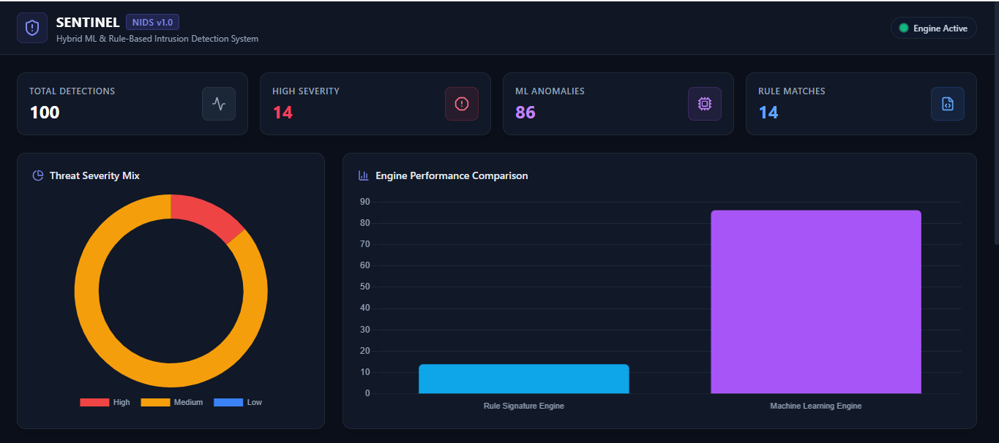
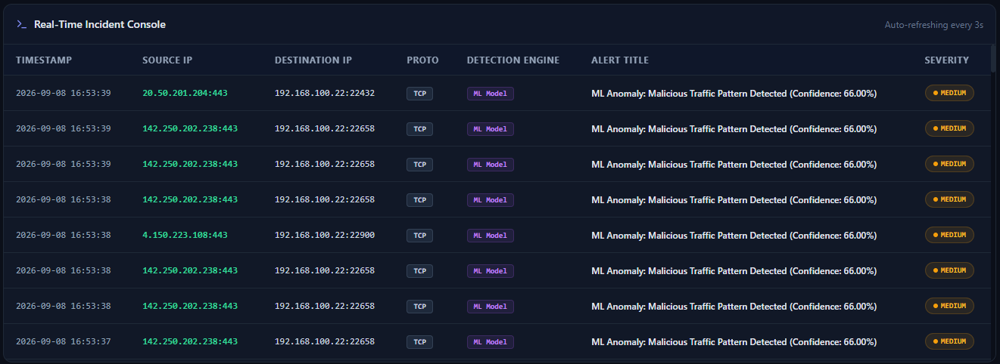
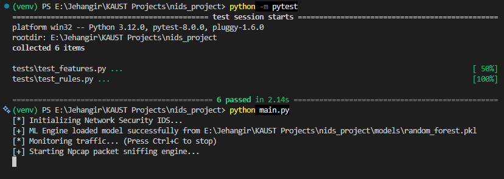

# 🛡️ SentinELK-NIDS: Hybrid Network Intrusion Detection System

[](https://www.python.org/)
[](LICENSE)
[](tests/)

A high-performance, hybrid **Machine Learning & Signature-Based Network Intrusion Detection System (NIDS)** featuring real-time packet inspection, automated feature extraction, persistent SQLite alert logging, and a web-based SOC Security Operations Dashboard built with Flask, Tailwind CSS, and Chart.js.

Designed and implemented for **KAUST Network Security & Threat Intelligence Research**.

---

## 🏗️ System Architecture

```text
                       ┌────────────────────────────────┐
                       │     Live Network Traffic       │
                       │     (Scapy + Npcap Sniffer)    │
                       └───────────────┬────────────────┘
                                       │
                                       ▼
                       ┌────────────────────────────────┐
                       │   Feature Extraction Engine    │
                       │  (Header, Flags, Ports, Vol)   │
                       └───────────────┬────────────────┘
                                       │
                    ┌──────────────────┴──────────────────┐
                    ▼                                     ▼
      ┌───────────────────────────┐         ┌───────────────────────────┐
      │   Signature Rule Engine   │         │    Machine Learning Engine│
      │  (Known Attacks / Ports)  │         │  (Random Forest / Anomaly)│
      └─────────────┬─────────────┘         └─────────────┬─────────────┘
                    │                                     │
                    └──────────────────┬──────────────────┘
                                       │ Alerts Triggered
                                       ▼
                       ┌────────────────────────────────┐
                       │     Alert Engine & Storage     │
                       │         (SQLite DB)            │
                       └───────────────┬────────────────┘
                                       │ REST API
                                       ▼
                       ┌────────────────────────────────┐
                       │     SOC Operations Dashboard   │
                       │     (Flask / Tailwind / JS)    │
                       └───────────────┬────────────────┘


## 📷 Screenshots & Dashboard UI

### SOC Operations Dashboard


### Real-Time Alerts & Threat Logging


### Packet Capture & Engine Terminal Output



✨Key Features:

Hybrid Detection Pipeline: Combines traditional signature rules (for fast detection of known threat signatures like SYN Scans and backdoor ports) with a trained Random Forest Classifier (for flow anomalies and unexpected packet behaviors).

Real-Time Packet Sniffing: Powered by Scapy and Npcap for native Layer 2/3 network interface monitoring.

SOC Operations Dashboard: Modern dark-mode monitoring console built with Tailwind CSS, Chart.js, and Lucide Icons that auto-refreshes every 3 seconds with active threat analytics.

Automated Attack Simulator: Includes a built-in testing script to simulate multi-vector network attacks (Port Scans, ICMP Sweeps, Suspicious Port Hits, ML Anomalies).

Robust Unit Test Suite: Fully covered with pytest for feature parsing and rule engine verification.

---

## 🛠️ Tech Stack & Requirements

| Component | Technology |
|---|---|
| **Programming Language** | Python 3.10+ |
| **Packet Sniffing** | Scapy 2.5+, Npcap Driver |
| **Machine Learning** | Scikit-Learn, Pandas, NumPy, Joblib |
| **Web Dashboard** | Flask, Tailwind CSS, Chart.js, Lucide Icons |
| **Database** | SQLite3 |
| **Testing Framework** | Pytest |

---

2. Installation & Setup
Clone the repository and set up a virtual environment:

# Clone Repository
git clone https://github.com/jehangir-99/network-intrusion-detection-system.git
cd network-intrusion-detection-system

# Create Virtual Environment
python -m venv venv

# Activate Virtual Environment (Windows PowerShell)
Set-ExecutionPolicy -Scope Process -ExecutionPolicy RemoteSigned
.\venv\Scripts\Activate

# Activate Virtual Environment (Linux/macOS)
source venv/bin/activate

# Install Dependencies
pip install -r requirements.txt

3. Model Training
Train the machine learning engine on feature vector flows:

python train.py

4. Running the System
Open two separate terminals running as Administrator (required for raw packet sniffing):

Terminal 1: Start Sniffer & IDS Pipeline
python main.py

Terminal 2: Start SOC Web Dashboard
python app.py

🧪 Testing & Verification
Run Automated Attack Simulator
To simulate live network attacks and verify alert generation on the dashboard, run:
python scripts/attack_sim.py

Run Pytest Suite
To verify feature extraction and signature detection logic:
python -m pytest


📁 Repository Structure

.
├── data/                  # Storage for PCAPs or CSV datasets
├── docs/                  # Screenshots and documentation artifacts
├── models/                # Trained ML model artifacts (.pkl)
├── scripts/
│   └── attack_sim.py      # Automated attack vector generator
├── src/
│   ├── __init__.py
│   ├── alert_engine.py    # Alert routing & correlation
│   ├── capture.py         # Scapy/Npcap packet capture engine
│   ├── database.py       # SQLite management module
│   ├── features.py        # Packet feature extraction engine
│   ├── ml_engine.py       # ML model inference engine
│   └── rules.py           # Signature-based detection engine
├── tests/
│   ├── test_features.py   # Pytest unit tests for feature parser
│   └── test_rules.py      # Pytest unit tests for signature engine
├── web/
│   ├── static/js/         # Chart.js & Dashboard JS logic
│   └── templates/         # HTML SOC Dashboard UI
├── app.py                 # Flask REST API & Web Server
├── conftest.py            # Pytest execution configuration
├── main.py                # System entry point script
├── requirements.txt       # Python package dependencies
├── train.py               # ML training script
└── README.md              # Project documentation